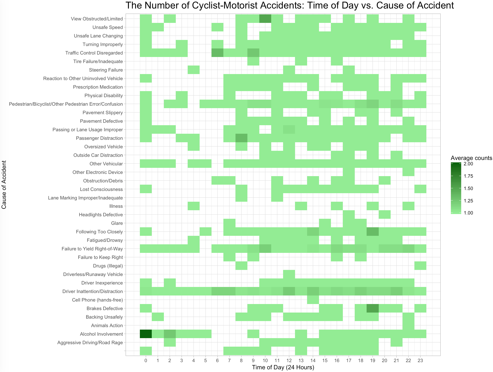

# PUI2017 HW8

### sac820@nyu.edu

I worked on this project by myself. I decided to look at cycle crashes with motor vehicles and tried to understand if time (day of week, month, time of day) had a role to play.
I also wanted to see the relationship between the cause and the accident. I got the data from NYC Open Data. However, their API gave a corrupted CSV. So I downloaded it.
But it was too large to push to GitHub and host there. So I hosted it on an AWS S3 bucket. I used R b/c I believe ggplot2 is a more powerful graphics library than
what Python has. I also don't want to get too rusty with R, so it's nice to have an exercise in it. 

