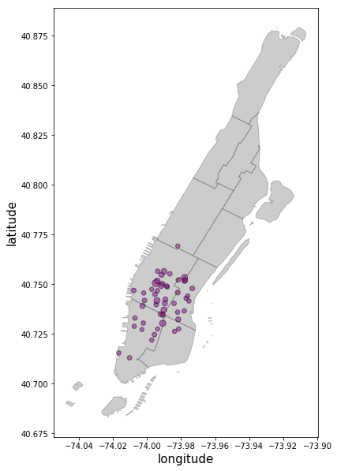

# PUI2017 HW9 Peer Plot Review

### Reviewer: Sean Chen (sac820@nyu.edu)
### Plot Author: Fangshu Lin (fl210@nyu.edu)

### CLARITY
It is quite clear in showing where the 50 most used CitiBike stations are in relation to all of Manhattan. However, it would perhaps be informative to see this in relation to all CitiBike stations. I do not know how many CitiBike stations there are in total and its total geographic service area. So it's a bit challenging to see the importance of the 50 most used stations. 

### ESTHETIC
The mapping element is clean and quite clear. However, it is unclear what the slightly bigger dots mean. Is it total users? Further, there is quite a bit of overlap and the color doesn't show the overlap as well to my eyes. There is also a lot of Manhattan that is not used. Perhaps a closer in aerial view would help show actual locations a great deal better. Perhaps what would work is a large map of these locations in relation to CitiBike service location and all stations and then an inset map closer up of this area of the 50 most used. 

### HONESTY
For the most part, no. It is quite clear and honest in demonstrating its point. However, the art in cartography is what information to show and what information to edit out. Because I do not know the average number of users per station I do not know the magnitude of difference of the 50 most used. Maybe if it's less than one standard deviation it doesn't matter that much and we're emphasizing these stations somewhat arbitrarily. Or maybe they are truly 2 standard deviations. In this line of thought, I don't know how many stations there are. Why the top 50?

### OVERALL
A clean and crisp map. I'm not sure the latitude and longitude marks are truly necessary. Nor are the outlying islands necessary unless it's to emphasize there are stations there (are there CitiBike stations on Rikers? Or Roosevelt? Or Governors? Or Liberty?).

# FBB good.

in addition, if using labels units should be spelled out, even if it is quite obvious that it is degrees.

10/10
