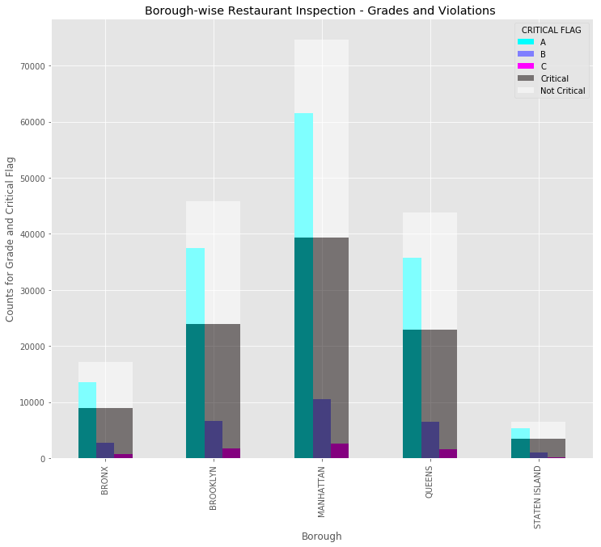

# PUI2017 HW9 Peer Plot Review

### Reviewer: Sean Chen (sac820@nyu.edu)
### Plot Author: Shreya Santosh Bamne (ssb602@nyu.edu)

### CLARITY
It is a very beautiful way to show the difference of types of violations by two different categorizations: flagging and critical/not critical. The only thing I would point out is I'm not the biggest fan of stacked bar charts mostly because I have trouble visually comparing the difference when they are stacked. That said, this is a very efficient way of showing multiple angles of the data in one image. 

### ESTHETIC
The colors are chosen nicely in that you have three colors that coordinate but differentiate one type of categorization and then a nice complementing different pair in another type of colorization for the other category. It is quite efficient and elegant in comparing the data in these multiple ways. But as mentioned before, I am not the biggest fan of the stacked bar charts. Also, the background color - while not totally confusing with the other colors - is not perhaps the best choice. Also, the vertical lines are not necessary perhaps. 

### HONESTY
I think it is quite clear with the data. The only thing I might add is that the data is not normalized in anyway. Manhattan has a lot more restaurants than Staten Island, right? Do we want to look at total, absolute numbers? Or do we want to see if there is a difference in quality of restaurant hygiene across boroughs perhaps showing some sort of socioeconomic pattern? The difference in absolute number of population and number of restaurants between boroughs can potentially mask this. 

### OVERALL
Overall a very elegant and efficient chart. I am conflicted about the stacked bar charts because it is conveying a great deal of information efficiently in a manner that lets us compare data. But, part of that comparison is hard for me to see. Technically, it does let us somewhat in our mind normalize the data: "ah, the critical to non critical ratio looks to be 1:1". But this is somewhat estimating. 

# FBB feedback: 
good, however you missed 2 critical things: the colored bars should be on top of the gray ones, since the visibility of the gray ones would not be impared and plotting them below changing the color greatly confusing the perception. 

the colors are not color blind compliant - they appear indistinguishable by most daltonic perceptions

9/10
