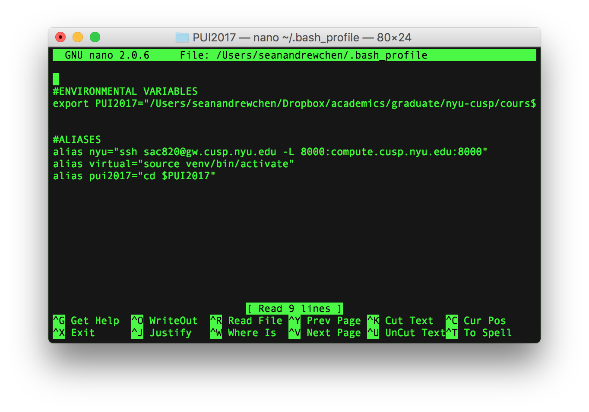

#2017 Principles of Urban Informatics
##Sean Andrew Chen 
##sac820@nyu.edu

#### Setting up shell aliases and environmental variables

1.Open and edit your bash profile using a built in text editor like nano, vim, or emacs

```{r, engine='bash'}
nano ~/.bash_profile
```

2. Type in the following for creating an alias:

```{r, engine='bash'}
alias alias_name="alias commands"
```

3. Type in the following for creating an environmental variable:

```{r, engine='bash'}
export VARIABLE_NAME="variable""
```



 
4. Before you can use your new alias and variable, remember to either restart terminal or source your bash profile.


#### Initializing a git repository and uploading to GitHub

1. Go to your GitHub account and make a new repository making sure **not** to create a readme file. Then go to its main page and look for instructions.
2. Open up your terminal and go to your directory that you will use. You can use your new alias pui2017. Create folders for the HW assignments and place your screenshots in the HW2 folder.
3. Initialize it as a git repository, add your files into the setup space,  and add a readme file.

```{r, engine='bash'}
git init
git add .
touch README.md
git add README.md
echo "# Title of your readme" >> README.md
```

4. Commit your work and add your GitHub repository as the origin and then push it to the GitHub repository. This is keeping in mind that you already created a SSH key from your computer and added it to your GitHub account.

```{r, engine='bash'}
git commit -m "initial commit"
git remote add origin https://github.com/yourgithubusername/yourrepositoryname.git
git push -u origin master
```

5. To edit your README file from the terminal, use a built in text editor. I prefer nano. Use the markdown language. 
```{r, engine='bash'}
nano README.md
```

